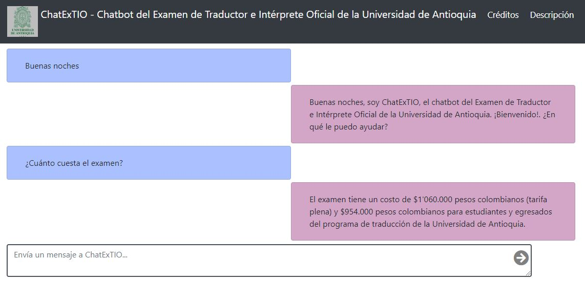

# ChatExTIO

Django Project with representation <i>Term Frequency - Document Inverse Frequency</i> (TF-IDF) and <i>Logistic Regression</i> model as the backend. The frontend using VueJS.

Requirements saved in `req.txt`

> pip install -r req.txt

Once you have installed all, you can running the following command:

> python chatextio/manage.py runserver

Once you have it running type message into textbox and it will return a message.

